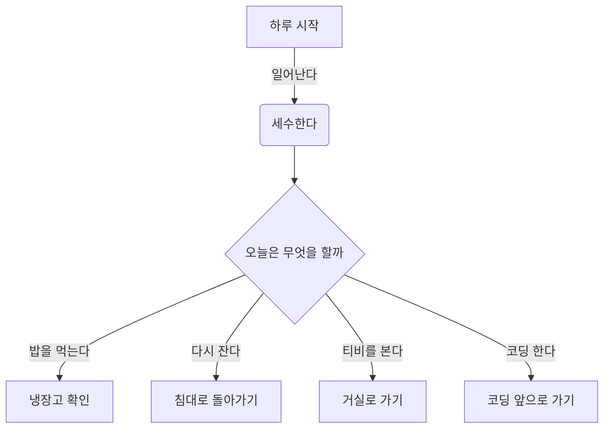

# testtest
testtest

```mermaid
 graph TD
        A[하루 시작] -->|일어난다| B(세수한다)
        B --> C{오늘은 무엇을 할까}
        C -->|밥을 먹는다| D[냉장고 확인]
        C -->|다시 잔다| E[침대로 돌아가기]
        C -->|티비를 본다| F[거실로 가기]
        C -->|코딩 한다| G[코딩 앞으로 가기]
```
